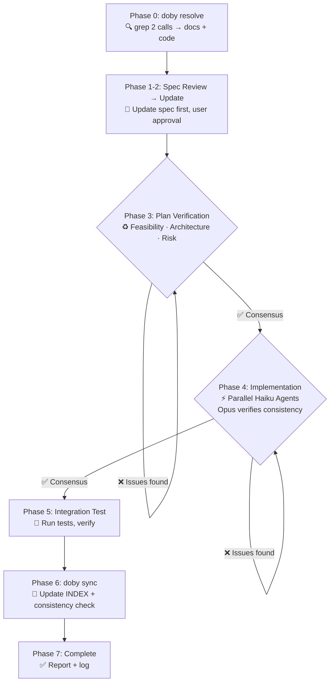

# doby — Spec-First Code Modification for LLM-Driven Development

[](https://opensource.org/licenses/MIT)
[](https://github.com/changmyoungkim/doby/stargazers)
[](https://github.com/changmyoungkim/doby/network)

**Keyword → Plan Doc → Code File → Symbol** in 2 grep calls (~100 tokens).

## The Problem

The biggest token waste in LLM-driven development is **finding where to make changes**. A single change request burns 2,000-5,000 tokens just on navigation. Then comes the greater waste: implementing code that violates the spec, requiring iteration and rework.

doby cuts navigation to ~100 tokens via pre-compiled indexing. More importantly, it enforces **spec-first workflows** — your plan docs become the source of truth, verified before code is written.

## How L1 Works

```
User: "fix the audio playback"

grep "audio" INDEX-keywords.md
→ audio:audio-playback.md,tts-config.md

grep "audio-playback.md" INDEX.md
→ @audio|audio-playback.md|src/hooks/useAudio.ts#useAudio,play;api/audio.py#get_audio|active

Done. 2 grep calls. Domain, plan doc, code files, symbols, status — all in one line.
```

## Spec-First Fix Workflow (Mode 6)

**The core differentiator.** When any code modification is requested:



**Time saved:** Navigation (2,000-5,000 tokens) + rework cycles (typically 2-4 rounds) = **90-95% token reduction on code changes**.

## Architecture: 4 Layers

```
Layer    Method              Cost         When
─────    ──────              ────         ────
L1       Flat-line Index     ~100 tokens  Always (90% of work)
L2       Wiki Pages          ~500 tokens  "Why?" questions only
L3       Semantic RAG        ~300 tokens  L1 miss (grep returns nothing)
L4       Auto-Compile        ~2,000 tokens Manual trigger only
```

**90% of daily work stays in L1.** Higher layers activate only when explicitly needed — core token savings are never diluted.

## Quick Start

```bash
# 1. Clone
git clone https://github.com/changmyoungkim/doby ~/.claude/skills/doby

# 2. Install (creates directories, installs chromadb)
cd your-project
bash ~/.claude/skills/doby/install.sh

# 3. Configure
# Edit .dobyrc.json with your project's mappings
# (install.sh copies the template automatically)

# 4. Build the index
# In Claude Code: /doby build
```

## Configuration

`.dobyrc.json` in your project root defines the mapping rules:

```json
{
  "scan_dirs": ["src", "backend", "frontend"],
  "file_extensions": [".py", ".ts", ".tsx", ".js"],
  "plans_dir": ".omc/plans",
  "wiki_dir": ".omc/wiki",

  "exact_file_map": {
    "src/index.ts": "app-entry"
  },
  "directory_rules": {
    "src/auth/": "auth-system",
    "backend/services/payment/": "payment-processing"
  },
  "keyword_to_doc": {
    "auth": "auth-system",
    "cache": "caching-layer"
  }
}
```

**Matching priority** (highest first):
1. `exact_file_map` — exact filepath match
2. `directory_rules` — directory prefix match (longest wins)
3. `keyword_to_doc` — keyword extracted from filepath
4. Fuzzy match — Jaccard similarity against doc names

## 7 Modes

### `build` — Full Index Build

```
/doby build
```

1. **Phase 1**: Python automapper scans codebase, applies 4-tier matching (0 LLM tokens)
2. **Phase 2**: LLM verifies mappings, classifies status (active/archived/orphan/planning)
3. **Phase 3**: Keyword extraction + symbol collection (parallel agents)
4. **Phase 4**: Optional ChromaDB RAG indexing
5. **Phase 5**: Write all 4 INDEX files, log, report

### `resolve` — Keyword Search

```
/doby audio
```

2 grep calls, 0 file reads. Returns domain, plan doc, code files, symbols, status.

Reverse lookup (code → doc):
```
grep "useAudio.ts" INDEX-codemap.md → plan doc + symbols in 1 call
```

### `fix` — Spec-First Modification Workflow

```
/doby fix "feature request or bug report"
```

**Phase 0-7 orchestration** (see Spec-First Fix Workflow above):
- Auto-find related specs + code
- Update spec docs first (requires approval)
- Verify architecture + feasibility in loop
- Implement via parallel agents with consistency checks
- Integration test
- Sync + verify all INDEX links
- Complete with detailed change report

**Input:** Free-form request. **Output:** Modified code + updated specs + change report.

This is the killer workflow for any code change request.

### `update` — Incremental Update

```
/doby update
```

Processes changes tracked by the PostToolUse hook. Uses `grep -n` to find the exact line, then edits that line only. ~300 tokens per update.

### `lint` — Health Check

```
/doby lint
```

Finds broken code links, orphan docs, missing mappings, renamed symbols. Suggests fixes — applies only after user approval.

### `compile` — Generate Wiki Page

```
/doby compile audio-playback
```

Reads plan doc + linked code, generates a wiki page with architecture overview, design decisions, and trade-offs. ~2,000 tokens per page, manual trigger only.

### `status` — Quick Status Report

```
/doby status
```

Grep-based status snapshot: total docs, active/archived/orphan/planning counts, pending changes, last build timestamp. ~50 tokens, instant response.

## Index Files

All files live in `.omc/plans/`. Flat-line format: 1 line = 1 record, reachable by `grep -n`.

### INDEX.md (Master Record)

```
@domain|plan_doc|code#symbol;code#symbol|status

@audio|audio-playback.md|src/hooks/useAudio.ts#useAudio,play;api/audio.py#get_audio|active
@auth|auth-system.md|src/pages/login.tsx;api/auth.py#login,refresh|active
@feature|feature-spec.md||planning
```

### INDEX-keywords.md (Keyword Map)

```
audio:audio-playback.md,tts-config.md
auth:auth-system.md
playback:audio-playback.md
```

### INDEX-codemap.md (Reverse Map: Code → Doc)

```
src/hooks/useAudio.ts:audio-playback.md#useAudio,play
api/auth.py:auth-system.md#login,refresh
```

### INDEX-log.md (Change History)

```
2025-01-15T12:00 build 50docs 20active 15archived 10orphan 5planning
2025-01-15T15:30 update audio-playback.md symbol_change:play→playTrack
```

## Hooks (Zero-Cost Change Tracking)

doby uses PostToolUse hooks to track file changes with **0 LLM tokens** — pure shell script.

Add to `~/.claude/settings.local.json`:

```json
{
  "hooks": {
    "PostToolUse": [{
      "matcher": "Write|Edit",
      "hooks": [{
        "type": "command",
        "command": "node ~/.claude/skills/doby/detect-change.mjs"
      }]
    }],
    "Stop": [{
      "matcher": "",
      "hooks": [{
        "type": "command",
        "command": "node ~/.claude/skills/doby/batch-report.mjs"
      }]
    }]
  }
}
```

- **detect-change.mjs**: When a tracked file is modified, appends its path to `doby-pending.txt`
- **batch-report.mjs**: At session end, reports accumulated changes and suggests `/doby update`

## L3: Semantic RAG (ChromaDB)

Activates only when L1 grep returns no results. Provides natural language search over plan docs and code.

```bash
# Index all plans and code
python ~/.claude/skills/doby/rag.py index

# Search
python ~/.claude/skills/doby/rag.py query "recommend places near user"

# Clear and rebuild
python ~/.claude/skills/doby/rag.py rebuild
```

## Token Efficiency

| Operation | Cost | Method |
|-----------|------|--------|
| `resolve` (search) | ~100 tokens | grep 2 calls, 0 file reads |
| `update` (incremental) | ~300 tokens | grep -n + line edit |
| `build` (full, once) | ~5,000-10,000 | Python heuristics + LLM verify |
| `lint` (health check) | ~1,000-2,000 | Parallel collect + judge |
| `compile` (wiki page) | ~2,000 | Manual trigger only |
| `status` (quick snapshot) | ~50 tokens | Grep only, no file reads |
| `fix` (code change request) | ~1,500-3,000 | Spec-first: less rework, fewer iterations |
| L3 RAG query | ~300 | On L1 miss only |
| Change tracking | **0** | Shell hook, no LLM |

**Per-session savings** (5-10 code change requests):
- Without doby: 50,000-150,000 tokens (navigation + rework cycles)
- With doby: 10,000-20,000 tokens (spec-first + index shortcuts)
- **80-90% token reduction**

## Design Principles

1. **Spec First** — Plan docs are source of truth; code follows spec, not vice versa
2. **Compile Once, Query Many** — build index once, reach any file via grep
3. **Read 0 Principle** — resolve/update never open INDEX files; grep output only
4. **Layered Cost** — expensive layers activate only when explicitly needed
5. **Zero-Cost Tracking** — change detection uses 0 LLM tokens

## File Structure

```
~/.claude/skills/doby/
├── SKILL.md                  Skill definition (modes, rules, format)
├── README.md                 This file
├── COMPARISON.md             15-tool competitive analysis
├── automap.py                Python automapper (4-tier heuristic)
├── rag.py                    ChromaDB semantic search (L3)
├── detect-change.mjs         PostToolUse hook (change tracking)
├── batch-report.mjs          Stop hook (session report)
├── install.sh                Setup script
└── .dobyrc.example.json      Config template

your-project/
├── .dobyrc.json              Project config (from template)
└── .omc/
    ├── plans/
    │   ├── INDEX.md           Master record
    │   ├── INDEX-keywords.md  Keyword map
    │   ├── INDEX-codemap.md   Code → doc reverse map
    │   ├── INDEX-log.md       Change history
    │   └── *.md               Plan documents
    ├── wiki/                  L2 wiki pages
    └── state/
        ├── doby-pending.txt      Change tracking
        └── doby-rag/             ChromaDB storage
```

## When to Use doby

**Good fit:**
- Small-to-medium projects (100-500 files) with plan docs
- Token-constrained budgets
- Plan-driven development (plan docs are source of truth)
- Code change requests must be spec-compliant
- No external service dependencies needed

**Not ideal:**
- Large monorepos (10K+ files) — consider Greptile or Augment
- No plan docs — doby's core value requires documentation
- Fully autonomous coding — Devin/SWE-agent are better suited

See [COMPARISON.md](COMPARISON.md) for a detailed analysis against 15 tools.

## License

MIT
